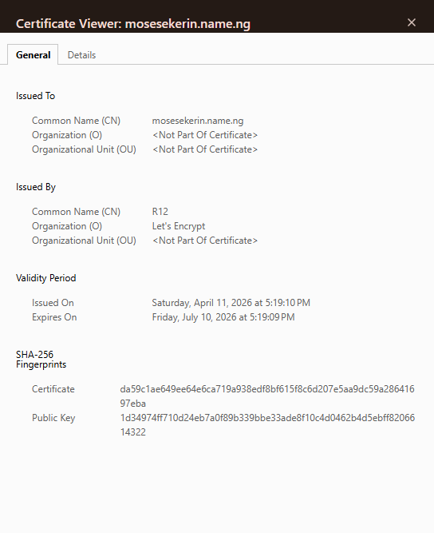
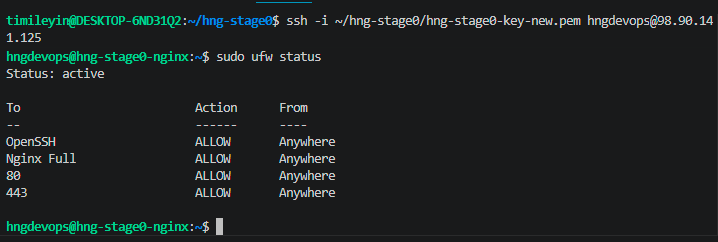
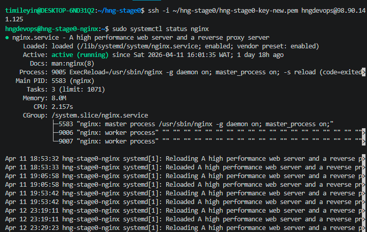

# Stage 0 DevOps: Linux Server Setup, Nginx, HTTPS & SSH Hardening

Provisioned and hardened a Linux virtual machine, configured Nginx to serve both static and JSON endpoints, enforced SSH key-only authentication, restricted ingress with UFW, and secured traffic end-to-end using a valid Let's Encrypt SSL certificate with HTTP → HTTPS **301 permanent redirect**.

---

## Project Overview

This project demonstrates foundational **Linux system administration, web server configuration, network hardening, and TLS termination** on a bare server.

The deployment was completed **without Docker, Compose, or automation tooling**, emphasizing direct operational competence at the Linux and service layers.

### Core Deliverables

* Linux server provisioned on a cloud provider
* Non-root sudo user (`hngdevops`) created
* Root SSH login disabled
* Password authentication disabled (SSH key-only)
* UFW enabled with only `22`, `80`, and `443` allowed
* Nginx configured as active web server
* `/` serves visible HNG username in HTML
* `/api` serves valid JSON with `application/json`
* Valid Let's Encrypt SSL certificate installed
* HTTP redirected to HTTPS using **301**

---

## Architecture / Request Flow

```text
Client
  ↓
DNS A Record → Public IP
  ↓
UFW (22, 80, 443 only)
  ↓
Nginx
  ├── GET /      → Static HTML response
  └── GET /api   → JSON response
  ↓
Let's Encrypt TLS termination
  ↓
HTTPS Response
```

This flow reflects layered responsibility across:

* **DNS layer** → domain resolution
* **Host firewall layer** → ingress filtering
* **Web server layer** → route handling
* **TLS layer** → encryption and certificate validation

---

## Security Hardening

### SSH Controls

* Created dedicated non-root user: `hngdevops`
* Added sudo privileges for controlled privilege escalation
* Disabled direct root SSH login
* Disabled password-based authentication
* Enforced public key authentication only

These controls improve:

* **named accountability** for privileged access
* reduced brute-force exposure
* reduced blast radius of credential compromise

### Firewall Policy

UFW was enabled with a **default deny inbound policy**.

Allowed ports:

* `22/tcp` → SSH
* `80/tcp` → HTTP
* `443/tcp` → HTTPS

All other inbound ports remain closed.

---

## Nginx Endpoint Design

### `GET /`

Serves a static HTML page containing the HNG username as visible text.

### `GET /api`

Returns structured JSON:

```json
{
  "message": "HNGI14 Stage 1",
  "track": "DevOps",
  "username": "Timileyin-Your-SRE-Guy"
}
```

### Response Guarantees

* HTTP status: `200 OK`
* Content-Type: `application/json`
* Exact route match on `/api`
* Username value is **case-sensitive** and matches HNG registration exactly

---

## TLS / HTTPS Configuration

HTTPS was enabled using a **valid Let's Encrypt SSL certificate**.

### TLS Controls

* Valid public CA-signed certificate
* HTTPS active on both `/` and `/api`
* Automatic HTTP → HTTPS redirect
* Redirect status code: **301 Moved Permanently**

### Certificate Lifecycle Validation

Certificate renewal was tested using:

```bash
sudo certbot renew --dry-run
```

This ensures the deployment remains operational beyond initial issuance.

---

## Validation & Operational Checks

The deployment was validated using explicit service and protocol checks.

### HTTP Redirect Validation

```bash
curl -I http://mosesekerin.name.ng
```

Expected:

```text
HTTP/1.1 301 Moved Permanently
Location: https://mosesekerin.name.ng/
```

### HTTPS Root Validation

```bash
curl -I https://mosesekerin.name.ng
```

Expected:

```text
HTTP/2 200
```

### API Validation

```bash
curl -i https://mosesekerin.name.ng/api
```

Expected:

```text
HTTP/2 200
Content-Type: application/json
```

### Firewall Validation

```bash
sudo ufw status numbered
```

### Nginx Service Validation

```bash
sudo nginx -t
sudo systemctl status nginx
```

### SSH Validation

```bash
ssh hngdevops@98.90.141.125
```

---

## Evidence / Screenshots

## Evidence / Screenshots

### Root Endpoint
Shows the static HTML page with visible HNG username.


### API Endpoint
Proof of valid JSON response over HTTPS.


### SSL Certificate
Valid Let's Encrypt certificate details from browser.



### UFW Status
Host firewall allowing only approved ports.



### Nginx Service Status
Proof that Nginx is the active web server.



### HNG Grading Result
Final evaluation proof.


```text
screenshots/
├── root-page.png
├── api-response.png
├── ssl-valid.png
├── ufw-status.png
├── nginx-status.png
└── grading-report.png
```

---

## HNG Evaluation Result

Final automated evaluation result:

> **10/10 — Passed**

Include the grading screenshot here as objective proof of compliance.

---

## Lessons Learned

This project reinforced several production-relevant operational principles:

* Host firewalls and cloud security groups operate at different control layers
* Exact Nginx route matching prevents accidental API drift
* TLS issuance depends on DNS correctness and propagation timing
* SSH hardening changes should always be tested in a secondary session before logout
* Service validation should use explicit protocol assertions, not browser-only checks

---

## Repository Structure

```text
.
├── README.md
├── nginx/
│   └── hng.conf
├── screenshots/
│   ├── root-page.png
│   ├── api-response.png
│   ├── ssl-valid.png
│   ├── ufw-status.png
│   └── grading-report.png
└── docs/
    └── validation-checks.md
```

---

## Why This Project Matters

This repository demonstrates practical ability across:

* Linux administration
* SSH hardening
* firewall policy enforcement
* Nginx routing
* TLS certificate lifecycle management
* production-style validation workflows

It serves as a strong foundational **DevOps portfolio artifact**, showing the ability to move from raw infrastructure provisioning to secure service delivery on a public endpoint.
